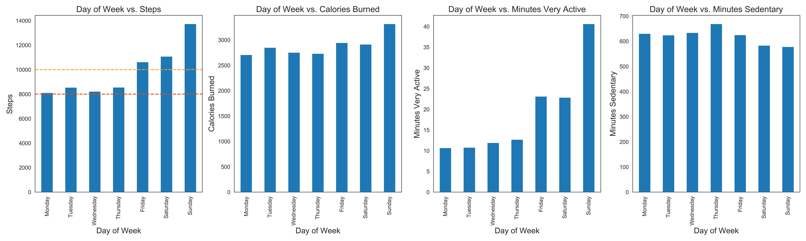
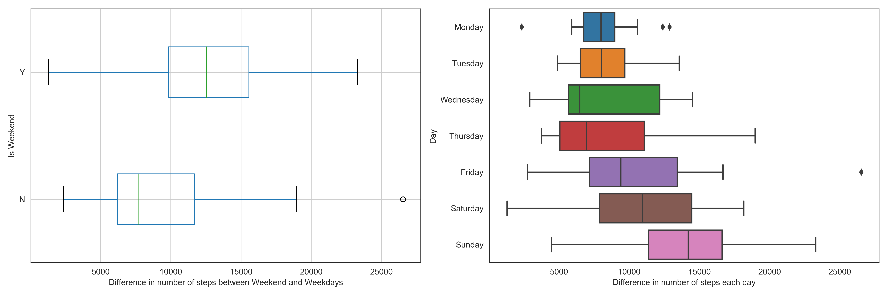
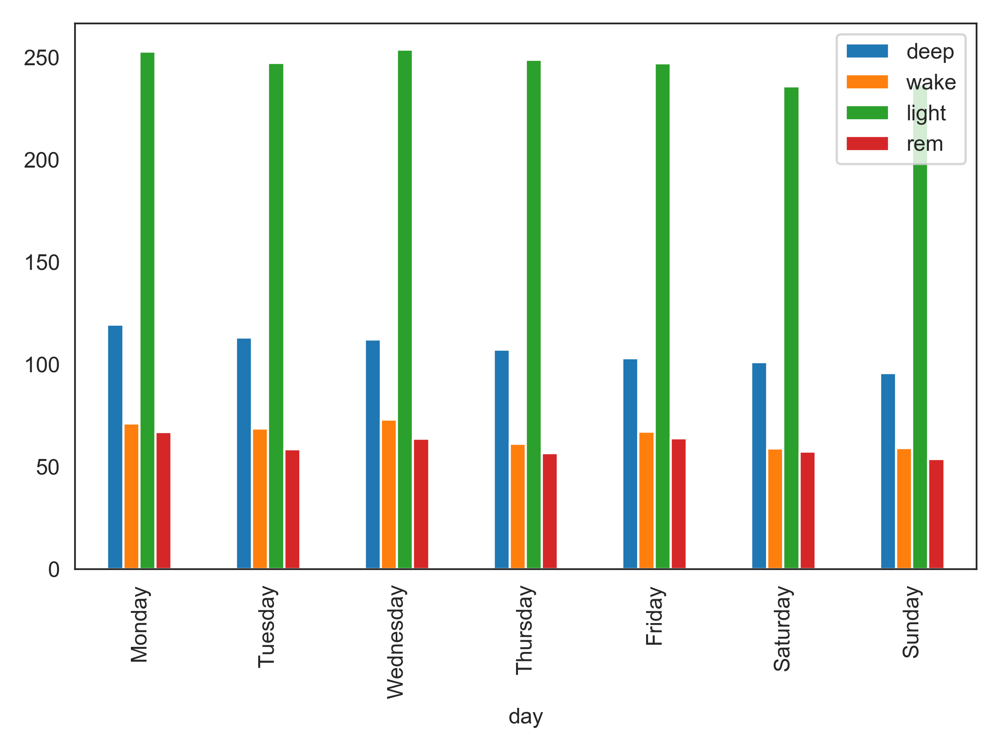
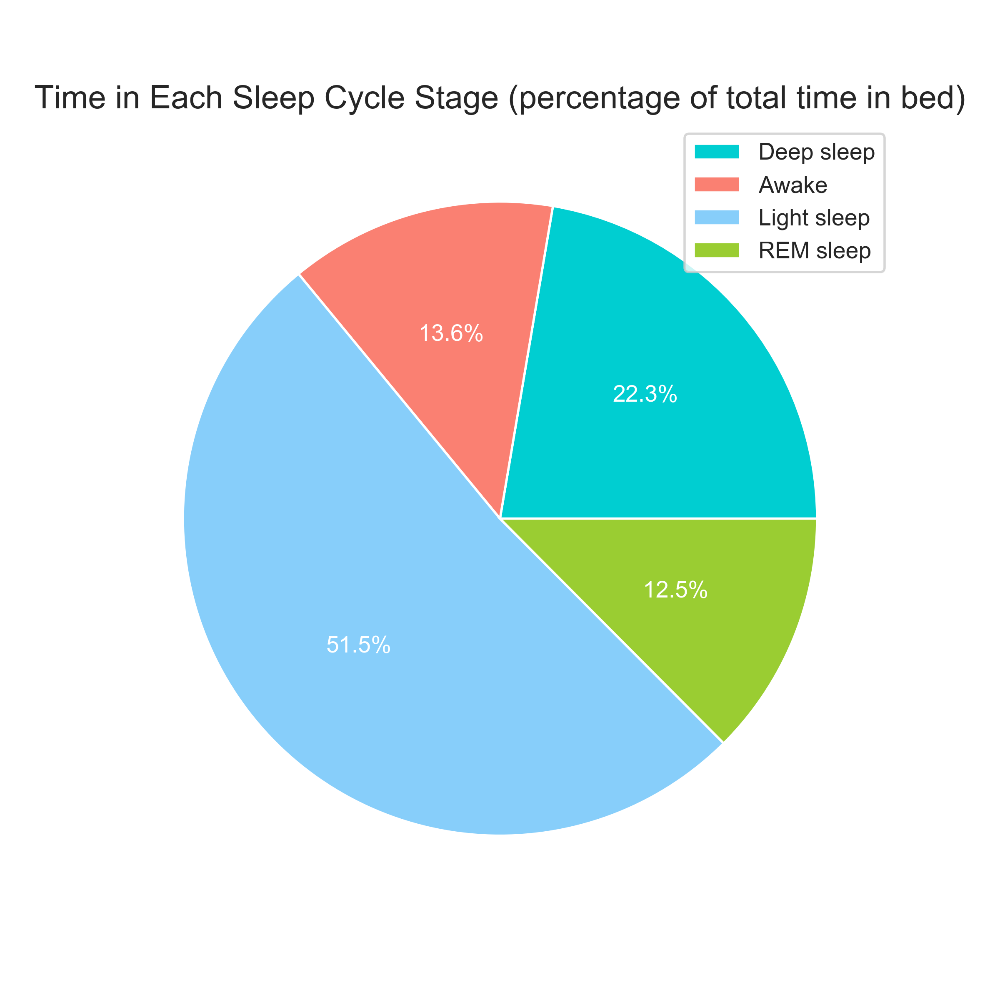
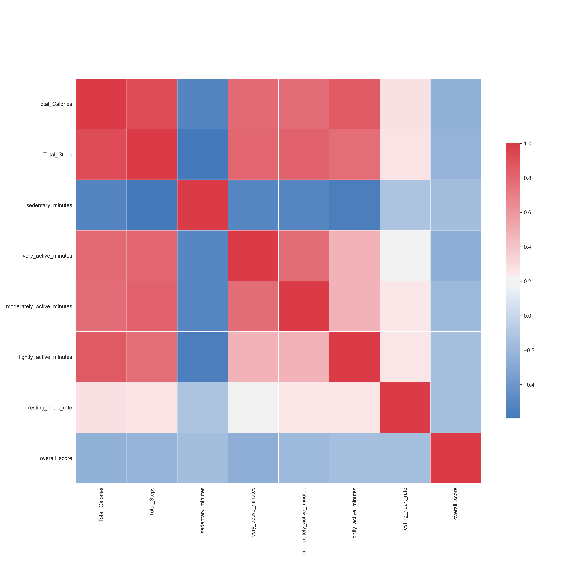

# Fitbit project

## Overview
This is a leisure project analysing Fitbit Data. It uses data taken from Fitbit Inspire HR, which include steps, calories, sleep, activity, bpm etc.

## Dataset
The dataset can be downloaded from one’s personal account at https://www.fitbit.com/settings/data/export. Once downloaded the setup is enough to run the python scripts.

## Setup & Run
` bash run.sh $1 $2  `

Where $1 is the name of the person's data (Full name as downloaded) and $2 is the data path

## Sample Results

These sample results are after a 3-month use of the Fitbit Inspire HR.

